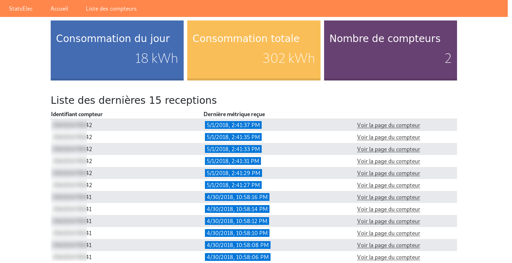
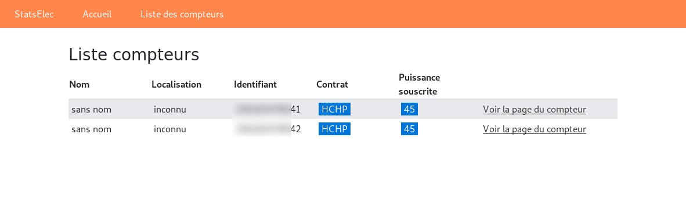
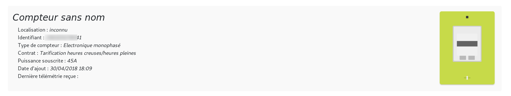
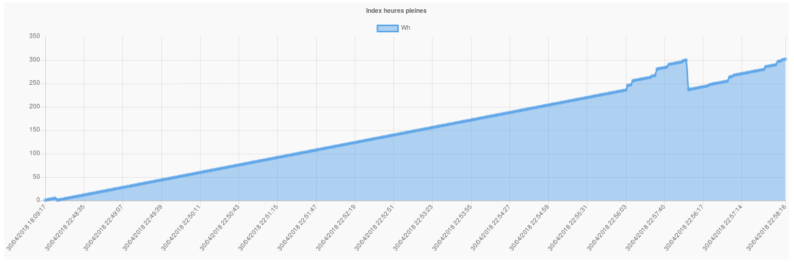

# Utilisation
_StatsElec_ est très simple d'utilisation, il est aucunement nécessaire de configurer l'outil pour recevoir la télémétrie de vos compteurs ! Ainsi, lorsque _StatsElec_ reçoit des données d'un nouveau compteur, le serveur ajoute le nouveau compteur ainsi que les données reçues.

## Page d'accueil (Dashboard)
Le _dashboard_ contient certaines informations utiles dont _la consommation totale_, _la consommation d'aujourd'hui_, _le nombre de compteurs_ ou encore la _liste des 15 dernières télémétries reçues_.

## Liste des compteurs
La liste des compteurs permet d'obtenir la liste des compteurs avec quelques informations concernant l'installation.

## Page du compteur
La page du compteur affiche dans un premier temps les informations concernant l'installation, le contrat, le type de compteur (si reconnu par _StatsElec_)

En dessous du bloc _informations_ se trouve l'ensemble des _graphiques_ contenant les télémétries remontées par le compteur.

